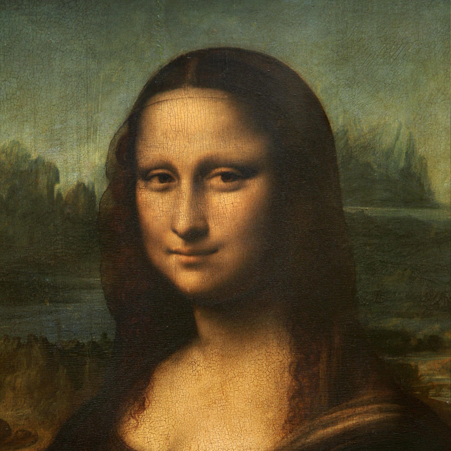

<p align="center">
    <h1 align="center"> Agent Maverick </h1>
</p>

<p align="center">
    
</p>

## About
Agent Maverick is a Telegram bot created during LifeHack 2022 Hackathon. In 24 hours, our team built a bot that allowed users to encrypt text messages into images using steganography. We won Honorable Mention for our theme. 
___

## User Experience

A big part of building **Agent Maverick's** interface on Telegram was to make the process as easy and intuitive for the user as possible.


We used the custom keyboards offered by Telegram to make the user experience intuitive. A user will only be prompted to send text when we request for the message to be encrypted.

## Encryption Process


After selecting the encryption process, the user will be asked to provide an image and the text to be encrypted. The bot will return an image that is visually identical. 


  |  
:-------------------------:|:-------------------------:
Original Image           |  Encrypted Image

## Decryption Process
The decryption process is simpler. It simple asks for an image from the user. If there is a hidden message, it will return the decrypted message if not it will inform the user the image does not contain an encrypted message.

## Delete Function


We built a delete function into the bot that would help clear all sensitive texts sent in the conversation. This was done by keeping track of all `messageIDs` sent in the particular chat and iterating over them to "clear" the chat after. This appeared to be a novel function that we did not see used in other Telegram bots we have come acrossed. 

## Limitations of the Bot
We tested multiple image filetypes and found that .png worked the most consistently. It appears that the way Telegram handles .jpeg, .jpg images involves some form of compression even if they were sent as **files**. We also found that .heic file types do not work as expected.

As the cryptography and embedding process is highly sensitive to any form of compression, we have to limit users to only send .png images as files for the bot to work as expected.

___

# Encryption

The process of encrypting the message was done via using Caesar Cipher and we followed a Least Significant Bit (LSB) Approach to embedded the encrypted message inside the image. 

## Cryptography 
*Caesar Cipher*


Each letter in the plaintext is 'shifted' a certain number of places down the alphabet. For example, with a shift of 1, A would be replaced by B, B would become C, and so on. 

When encrypting, a person looks up each letter of the message in the "plain" line and writes down the corresponding letter in the "cipher" line.

```
Plaintext:  THE QUICK BROWN FOX JUMPS OVER THE LAZY DOG

Ciphertext: QEB NRFZH YOLTK CLU GRJMP LSBO QEB IXWV ALD

```
For our encryption, deciphering is done in reverse, with a right shift of 3.

We were able to write the encryption and decryption functions of the Caesar cipher from scratch. The encryption can also be represented using modular arithmetic by first transforming the letters into numbers, according to the scheme, A → 0, B → 1, ..., Z → 25. Encryption of a letter x by a shift n can be described mathematically as,

$${\displaystyle E_{n}(x)=(x+n)\mod {26}.}$$

Decryption is performed similarly,

$${\displaystyle D_{n}(x)=(x-n)\mod {26}.}$$


___

## Image Steganography 
*Least Significant Bit (LSB) Approach*

Digital images may be described as finite sets of pixels. Pixels are in turn defined to be the smallest individual element of an image. They hold values to represent the brightness of a given colour at any specific point. As such, we can think of images as a matrix of pixels.

In the LSB approach, we replace the last bit of each pixel with each bit of our ciphertext. Each pixel contains 3 values: Red, Green and Blue. These values range from 0 to 255. By encrypting and converting the secret message into binary, we iterate over the pixel values 1 by 1, replacing each LSB with the ciphertext bits sequentially. Since we are only modifying pixel values by +1 or -1, any changes in the resultant image will be indistinguishable to the human eye.

<p align="center">
    
</p>


Image steganographic functionalities are built with `NumPy` and `opencv-python`. We settled for NumPy because we can enjoy the flexibility of `Python` and the speed of compiled C code at its core. What is more, is that NumPy indexing is the de facto standard of array computing today. `OpenCV` was another obvious choice for us as it is one of the famously used open-source `Python` libraries meant exclusively for Computer Vision. Modules and methods available in OpenCV allow us to perform image processing with a few lines of code. 

## Challenges we ran into
We experimented with discrete cosine transform as our implementation for image steganography. Unfortunately, the resultant image has a tinge of a strange blue hue to it. As a result, we scrapped our work and started from square 1 again. This time, we looked to modify the least significant bit of each pixel in the image. We are glad that the resultant image turned out to be indistinguishable from the original, at least to the human eye.

As it was our first time working with complex cryptographic methodologies such as the AES and the RSA, it was unfortunate that we were unable to overcome this obstacle head-on. Instead, we found a workaround to the issue. By turning to the simpler Caesar cipher, we were able to come up with a working product to serve as a working proof of concept. We believe this is the most rational way forward.


## What We Learn
From discrete cosine transforms to replacing the least significant bits in the pixels, we learnt a lot about image steganography and the mathematical intuition behind it. We thought it was a great introduction to the subject of media computing. This project enabled us to learn more about modern cryptographic concepts; their performances, their effectiveness, as well as their tradeoffs.

Thank you for reading all the way to the end!
