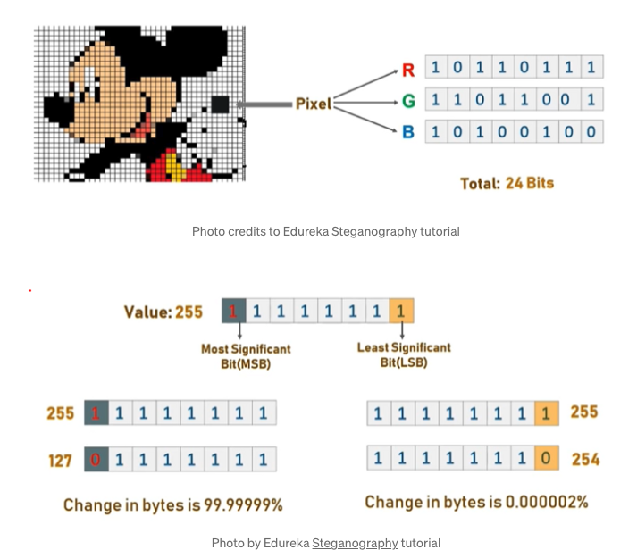

# lifehack22-PrBros
LifeHack 2022 

# Set up Python Virtual Environment 
- `python3 -m pip install --user virtualenv`
- `python3 -m venv env`
- `source env/bin/activate`
- To leave: `deactivate` 

## Inspiration
Ever had the need to encrypt a message, but not wanting it to look painfully obvious that it has been encrypted? We do! From personal details to bank account numbers, there are plenty of instances where encryption comes in handy. It doesn't just end here in our project. In our project, we take it a notch higher.

We decided to create a Telegram bot as our end user service interface because Telegram is a cross-platform messaging platform that is becoming increasingly popular. A Telegram bot would also suffice as a working proof of concept.

## What it does
{Project Name} is a Telegram bot that takes in an image alongside the secret message that the user intends to hide. We encrypt the secret message using {technique} then embed the ciphertext into the image provided via image steganography. The resultant image is then sent back to the user. 

There are 2 key functionalities in our project:

### Cryptography (Caesar Cipher)
It is a type of substitution cipher in which each letter in the plaintext is 'shifted' a certain number of places down the alphabet. For example, with a shift of 1, A would be replaced by B, B would become C, and so on. It is a type of substitution cipher in which each letter in the plaintext is 'shifted' a certain number of places down the alphabet. For example, with a shift of 1, A would be replaced by B, B would become C, and so on.
When encrypting, a person looks up each letter of the message in the "plain" line and writes down the corresponding letter in the "cipher" line.

Plaintext:  THE QUICK BROWN FOX JUMPS OVER THE LAZY DOG
Ciphertext: QEB NRFZH YOLTK CLU GRJMP LSBO QEB IXWV ALD
Deciphering is done in reverse, with a right shift of 3.

### Image Steganography (Least Significant Bit (LSB) Approach)
Digital images may be described as a finite set of pixels. Pixels, are in turn defined to be the smallest individual element of an image. They hold values to represent the brightness of a given colour at any specific point. As such, we can think of images as a matrix of pixels.

In the LSB approach, we replace the last bit of each pixel with each bit of our ciphertext. Each pixel contains 3 values: Red, Green and Blue. These values range from 0 to 255. By encryting and converting the secret message into binary, we interate over the pixel values 1 by 1, replacing each LSB with the ciphertext bits sequentially. Since we are only modifying pixel values by +1 or -1, any changes in the resultant image will be indistinguishable to the human eye.

## How we built it

### Telegram Bot

### Cryptography
Due to the simplicity of the cipher, we were able to write the encryption and decryption functions of the Caesar cipher from scratch. The encryption can also be represented using modular arithmetic by first transforming the letters into numbers, according to the scheme, A → 0, B → 1, ..., Z → 25. Encryption of a letter x by a shift n can be described mathematically as,

$${\displaystyle E_{n}(x)=(x+n)\mod {26}.}$$

Decryption is performed similarly,

$${\displaystyle D_{n}(x)=(x-n)\mod {26}.}$$

### Image Steganography
Image steganographic functionalities are built with NumPy and opencv-python. We settled for NumPy because we are able to enjoy the flexibility of Python as well as the speed of compiled C code at its core. What is more is that NumPy indexing is the de facto standard of array computing today. OpenCV was another obvious choice for us as it is one of the famously used open-source Python libraries meant exclusively for Computer Vision. Modules and methods available in OpenCV allow us to perform image processing with a few lines of codes. We wanted to make use of this hackathon to learn a little more about Computer Vision techniques.

## Challenges we ran into
We experimented with discrete cosine transform as our implementation for image steganography. Unfortunately, the resultant image has a tinge of a strange blue hue to it. As a result, we scrapped the our work and started from square 1 again. This time, we looked to modify the least significant bit of each pixel in the image. We are glad that the resultant image turned out to be indistinguishable from the original, at least to the human eye.

As it was our first time working with complex cryptographic methodologies such as the AES and the RSA, it was unfortunate that we were unable to overcome this obstacle head-on. Instead, we found a workaround to the issue. By turning to the simpler Caesar cipher, we were able to come up with a working product to serve as a working proof of concept. We believe this is the most rational way forward.

## Accomplishments that we're proud of
We are immensely proud of the fact that we were able to come up with a working product under 2 hours that has viable use cases in the real world. On hindsight, we felt that we handled obstacles along the way really well despite treading into unknown waters. Regardless of the outcome of the competition, we are glad that we will be walking away with new found knowledge in the field of computer science.

## What we learned
From discrete cosine transforms to replacing the least significant bits in the pixels, we learnt a ton about image steganography and the mathematical intuition behind it. We thought it was a great introduction to the subject of media computing. We are also glad that we decided on the security theme, for it enabled us to learn more about modern cryptographic concepts; their performances, their effectiveness, as well as their tradeoffs. 

## What's next for Untitled
We hope that we will be to able to include an array of encryption methods for the users to choose from to encrypt their secret messages before embedding them into images. A few notable encryption schemes that we hope to integrate into our Telegram bot are AES, RSA, Vignere cipher as well as the keyword cipher. On top of that, we are looking to allow users to opt for audio steganography as well. For that, we plan to rely on Fourier Transforms to achieve the desired outcome.
